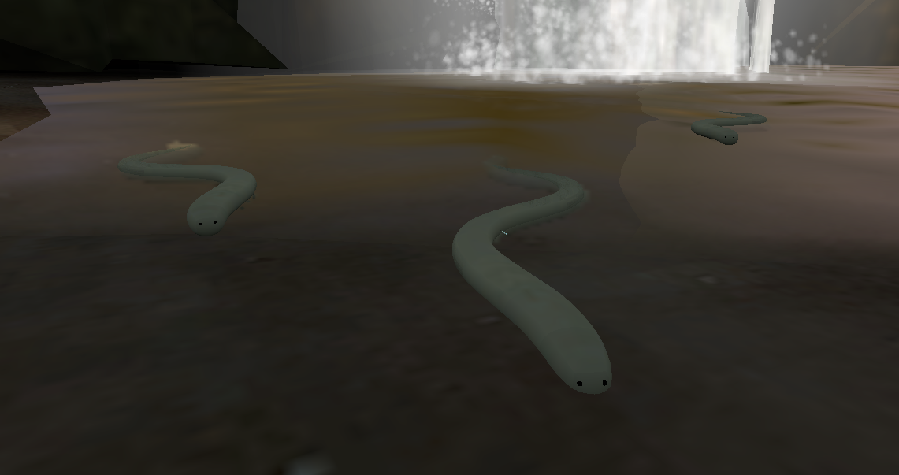

# TF2 Snakes

On September 16th, 2021, the TF2 developers released, without a doubt, the biggest, best and most glorious update ever, I was already giving up on TF2 as the bots were infesting all the servers, BUT thanks to one of the changes I won't go anymore, and the change was "Nature & Wildlife preservation measures" (at first it appeared to be nothing).

In this update 9 snakes in the water were added to the "snakewater" map (in the middle, the lake and the waterfall).

## Lake

### Coords:

- X: 1554.5 Z: -3176.5 Y: -108.5
- X: 1416.5 Z: -3226.5 Y: -121.5
- X: 1454.5 Z: -3334.5 Y: -127.5

## Waterfall

### Coords:

- X: -432.5 Z: 3588.5 Y: -109.5
- X: -411.5 Z: 3531.5 Y: -108.5
- X: -307.5 Z: 3598.5 Y: -117.5

## Middle:

### Coords:

- X: 532.5 Z: 234.5 Y: -111.5
- X: 603.5 Z: 208.5 Y: -106.5
- X: 539.5 Z: 141.5 Y: -109.5

---

Each one has 8576 tris 

That is, we have **77184 tris** of pure glory. 
